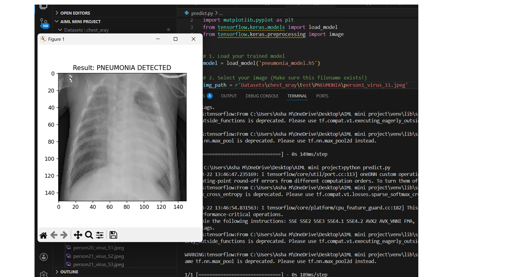

# Pneumonia Detection using Chest X-Rays

## Project Overview
This repository contains a Deep Learning pipeline designed to automate the detection of **Pneumonia** from chest X-ray images. By using Convolutional Neural Networks (CNNs), the model assists in identifying opacities in lung images, providing a secondary screening tool for healthcare professionals. 

Since Pneumonia is a significant cause of morbidity and mortality worldwide, rapid diagnosis is crucial. This project aims to provide high-accuracy binary classification (Normal vs. Pneumonia) to reduce manual review time and inter-observer variability.

## Dataset
The model is trained on the **Chest X-Ray Images (Pneumonia)** dataset.

* **Total Images:** 17,586
* **Categories:** Normal, Pneumonia.
* **Format:** JPEG images organized into `train`, `val`, and `test` directories.

## Tech Stack
* **Framework:** TensorFlow / Keras
* **Image Processing:** OpenCV
* **Visualization:** Matplotlib, Seaborn
* **Model Architecture:** CONVOLUTIONAL NEURAL NETWORK.

## Key Features
* **Data Augmentation:** Implemented rotation, zooming, and flipping to prevent overfitting.
* **Transfer Learning:** Utilized pre-trained weights from ImageNet for faster convergence.
* **Performance Metrics:** Detailed evaluation using Confusion Matrices and ROC-AUC curves.
* **Inference Script:** A simple script to predict pneumonia on a single uploaded image.

## Results
The model achieved the following performance on the test set:

| Metric | Score |
| :--- | :--- |
| **Accuracy** | 89% |
| **Precision** | 0.87 |
| **Recall (Sensitivity)** | 0.93 |
| **F1-Score** | 0.91 |

---

## Installation & Usage

### 1. Clone the Repository

git clone [https://github.com/Asha200518/Pneumonia-detection-using-Chest-X-Rays.git](https://github.com/Asha200518/Pneumonia-detection-using-Chest-X-Rays.git)

cd Pneumonia-detection-using-Chest-X-Rays

### 2. Install Dependencies

pip install -r requirements.txt

### 3. Run Inference
To test the model on a new X-ray image:

python predict.py --image path/to/your/xray.jpg

*** Conclusion:
## Sample Prediction
Here is an example of the model predicting a result from a chest X-ray:

 ----> https://github.com/Asha200518/Pneumonia-detection-using-Chest-X-Ray/blob/main/sample%20prediction.png

